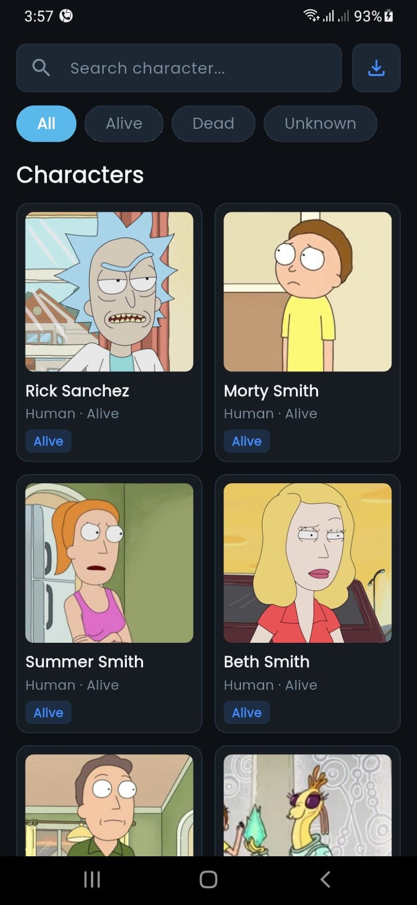
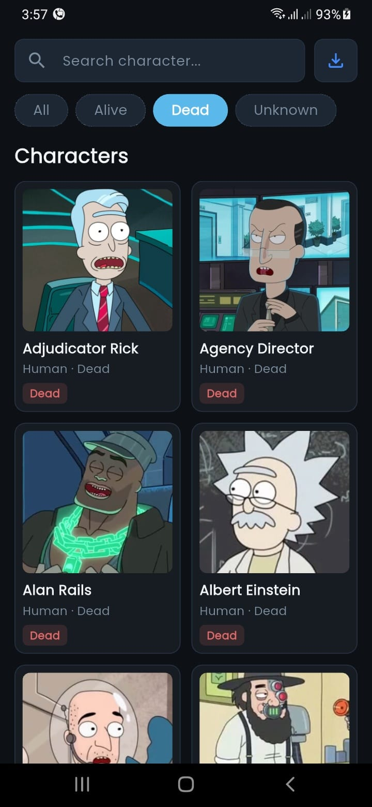
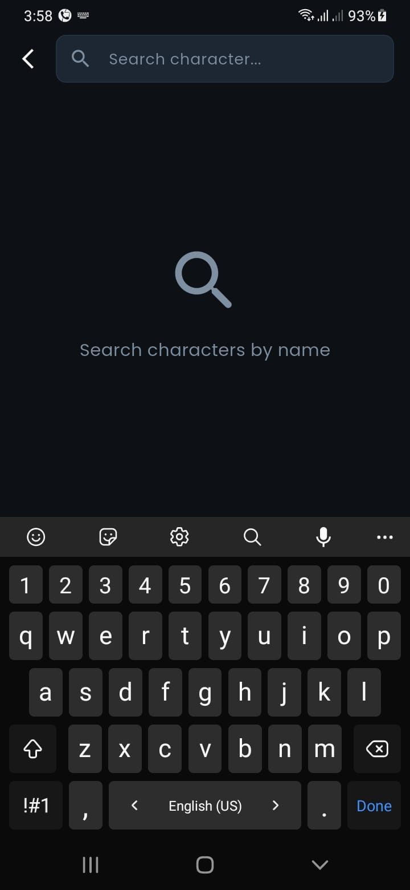
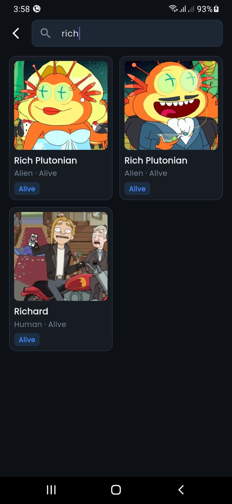
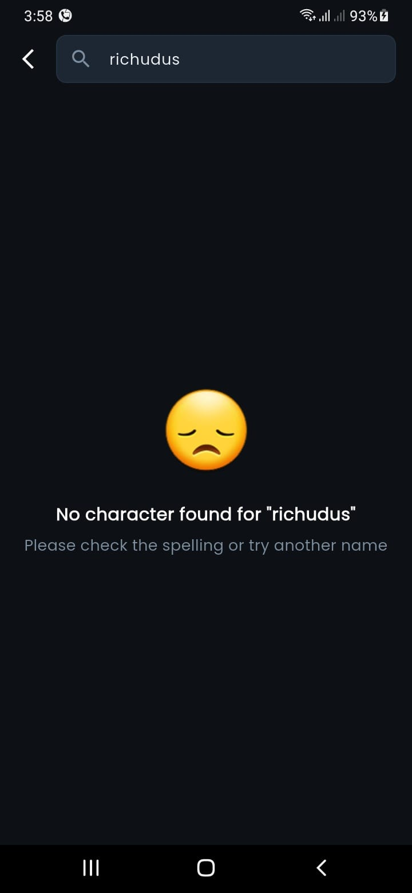
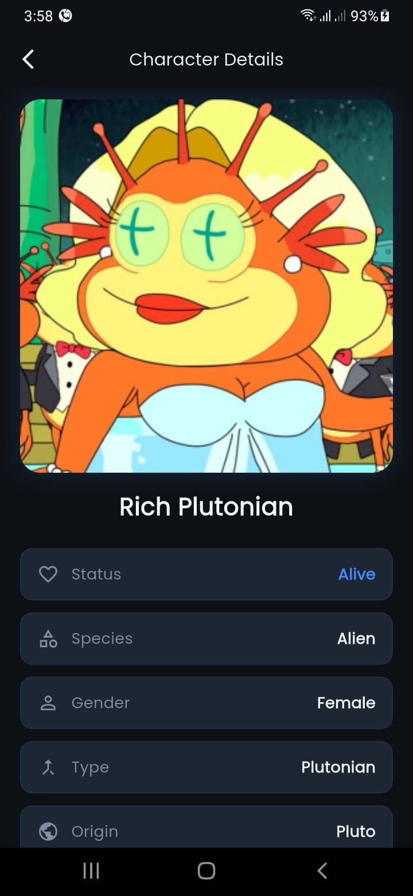

<div align="center">
  <h1>🛸 Character Hub - Rick and Morty</h1>
  <p>A modern, clean, and responsive Flutter application integrating with the <b>Rick and Morty API</b>.</p>

  <p>
    <a href="#about-the-project">About</a> •
    <a href="#key-features">Key Features</a> •
    <a href="#app-screenshots">Screenshots</a> •
    <a href="#packages--dependencies">Packages</a> •
    <a href="#clean-architecture--project-structure">Architecture</a> •
    <a href="screenshots/video.mp4" target="_blank">Video Demo 🔗</a> •
    <a href="#getting-started">Getting Started</a>
  </p>
</div>

<hr />

## 📖 About The Project

<b>Character Hub</b> is a Flutter application that connects with the <a href="https://rickandmortyapi.com/documentation">Rick and Morty API</a> to browse and explore all the show's characters.

The app displays the full list of characters, lets you filter them by status (Alive, Dead, Unknown), and includes a real-time search with debouncing for a smooth, fast experience. You can also export the character data to Excel, all wrapped in a clean, polished dark-themed UI.

---

## ✨ Key Features

- 📜 <b>Fetch All Characters:</b> Browse the complete list of characters smoothly.
- 🎯 <b>Dynamic Filtering:</b> Filter characters instantly by status (<i>All, Alive, Dead, Unknown</i>).
- 🔍 <b>Real-time Search with Debouncing:</b> Search characters by name efficiently using custom debouncing (500ms) to optimize API requests.
- 📊 <b>Export Data to Excel (.xlsx):</b> Export fetched character lists into standard Excel spreadsheets.
- 🎨 <b>Modern UI/UX:</b> Dark mode layout, custom search bar, smooth feedback, empty states, and loading shimmers.
- 🏛️ <b>Clean Architecture:</b> Organized structure strictly adhering to Separation of Concerns (Data, Domain, Presentation).

---

## 📸 App Screenshots

<div align="center">
  <table>
    <tr>
      <td align="center" width="50%">
        <b>Home Screen - All Characters</b><br /><br />
        
      </td>
      <td align="center" width="50%">
        <b>Filter by Status (Dead)</b><br /><br />
        
      </td>
    </tr>
    <tr>
      <td align="center" width="50%">
        <b>Search View Initial State</b><br /><br />
        
      </td>
      <td align="center" width="50%">
        <b>Search Results</b><br /><br />
        
      </td>
    </tr>
    <tr>
      <td align="center" colspan="2">
        <b>Empty State (No Results Found)</b><br /><br />
        
      </td>
    </tr>
    <tr>
      <td align="center" colspan="2">
        <b>Character Details</b><br /><br />
        
      </td>
    </tr>
    <tr>
      <td align="center" colspan="2">
        <b>Video Demo</b><br /><br />
        <video src="screenshots/video.mp4" controls width="280">
          Your browser does not support the video tag.
        </video>
      </td>
    </tr>
  </table>
</div>

---

## 📦 Packages & Dependencies

This project leverages a well-curated list of industrial-standard Dart packages:

| Package | Purpose / Description |
| :--- | :--- |
| <b>`flutter_bloc` / `bloc`</b> | State Management pattern implementation. |
| <b>`dio`</b> | Powerful HTTP client for handling API requests & query params. |
| <b>`dartz`</b> | Functional programming concepts (handling `Either<Failure, Success>`). |
| <b>`get_it`</b> | Dependency Injection (Service Locator). |
| <b>`equatable`</b> | Simplifies value equality comparison in Bloc states. |
| <b>`go_router`</b> | Declarative routing solution for screen navigation. |
| <b>`excel`</b> | Generating and creating Excel spreadsheets (.xlsx). |
| <b>`path_provider`</b> | Accessing device file system storage paths. |
| <b>`open_file`</b> | Opening exported Excel files directly on the device. |
| <b>`cached_network_image`</b> | Efficient image caching for network avatar images. |
| <b>`shimmer`</b> | Animated shimmer loading indicators for UI feedback. |
| <b>`google_fonts`</b> | Custom typography support. |

---

## 🏛️ Clean Architecture & Project Structure

The project strictly follows **Clean Architecture** principles layered into three main layers per feature:

- 🟢 **Domain Layer:** Contains pure business logic.
  - **`Repository Interface`**: Defines abstract contracts for fetching characters without caring about data sources.
  - **`Entity`**: Pure data models.
  - **`UseCase`**: Encapsulates specific business rules.
- 🔵 **Data Layer:** Handles data collection and network interaction.
  - **`Repository Implementation (RepoImpl)`**: Implements domain interfaces and handles network responses via Remote Data Sources.
  - **`Model`**: JSON parsing and mapping logic (`fromJson`).
- 🔴 **Presentation Layer:** Handles UI and User Interaction.
  - **`Cubit / State`**: Manages app state and triggers domain UseCases.
  - **`Views & Widgets`**: UI layout rendering.

### 📁 Directory Layout

```text
lib/
 ├── core/
 │    ├── utils/
 │    └── services/            # ApiService, ExcelExportService, Service Locator
 └── feature/
      ├── home/
      │    ├── data/           # Models, Data Sources & Repository Implementations (RepoImpl)
      │    ├── domain/         # Entities, Repository Interfaces (Repo) & UseCases
      │    └── presentation/   # CharacterCubit, Views & UI Widgets
      └── search/
           └── presentation/   # Search Views & Search Body Widgets
```

---

## 🚀 Getting Started

Follow these instructions to get a copy of the project running on your local machine:

1. **Clone the repository:**

   ```bash
   git clone https://github.com/YOUR_GITHUB_USERNAME/character_hub.git
   ```

2. **Install dependencies:**

   ```bash
   flutter pub get
   ```

3. **Run the application:**

   ```bash
   flutter run
   ```